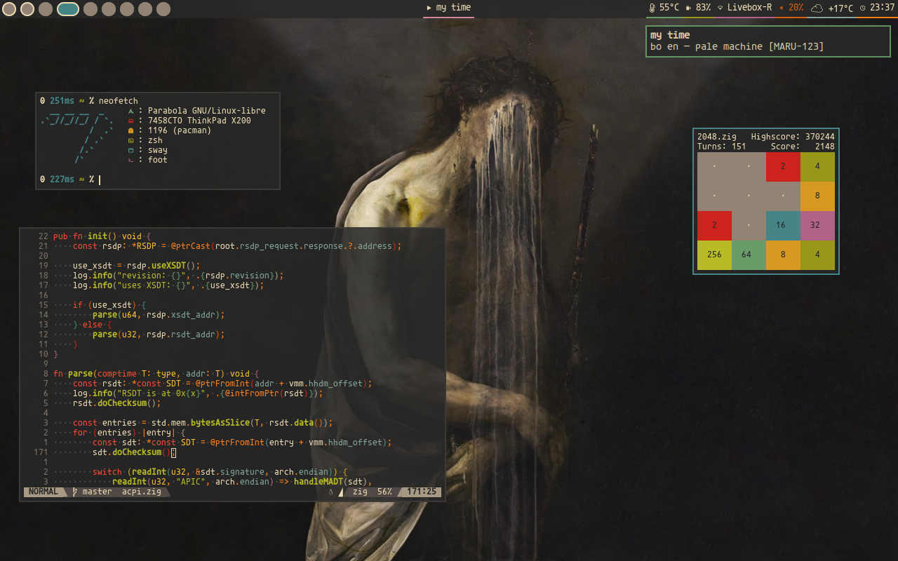
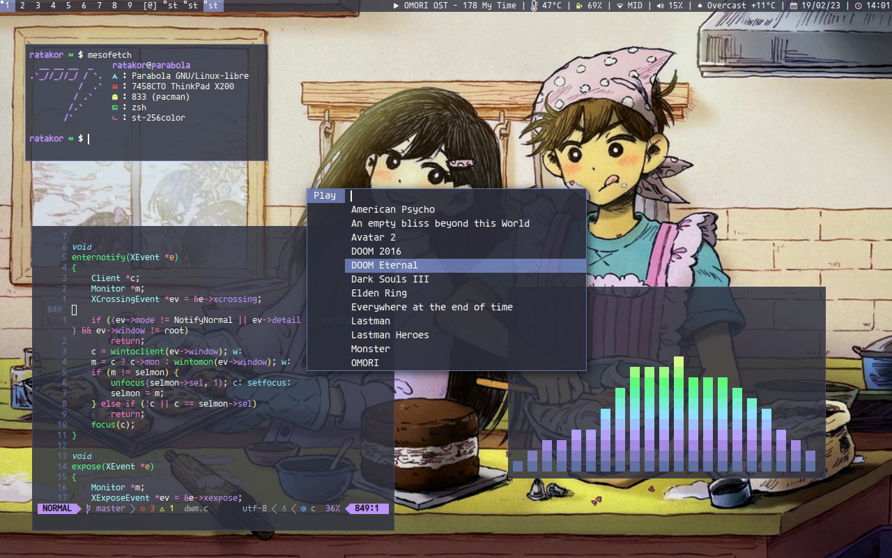

<h1 align="center">My dotfiles</h1>

(river not sway! at least fastfetch got it right)

(Outdated screenshot, my [artix](https://github.com/ratakor/dotfiles/tree/artix) config still look like that)

## Installation
I follow the [.local convention](https://gist.github.com/Earnestly/84cf9670b7e11ae2eac6f753910efebe)
to a point that I have just one dotfile in $HOME (yes no ~.ssh~, .dbus or ~.pki~)
so you'll need to tweak the Makefile if you don't. Also if you're not using
Parabola OpenRC you will probably need to edit .local/share/packages according
to your distro.

DO NOT TRY TO INSTALL if it's not a fresh install and you don't know what you're doing.
**This is outdated, I need to do an installation script instead of a simple makefile because of dependencies issues**

	$ git clone https://github.com/ratakor/dotfiles.git
	$ cd dotfiles/.local
	$ make

## Softwares

### Graphical environment
- Window manager: [river](https://github.com/riverwm/river)
- Bar: [waybar](https://github.com/Alexays/Waybar)
- Terminal emulator: [foot](https://codeberg.org/dnkl/foot)
- Dynamic menu: [tofi](https://github.com/philj56/tofi)
- Web Browser: [Cromite](https://www.cromite.org)
- Theme: [Gruvbox](https://github.com/morhetz/gruvbox)

### Command Line Interface
- Shell: [zsh](https://github.com/zsh-users/zsh)
- Editor: [neovim](https://github.com/neovim/neovim)
- Terminal workspace: [zellij](https://zellij.dev/)
- File manager: [yazi](https://github.com/sxyazi/yazi)
- Calendar: [quand](https://github.com/ratakor/quand)
- RSS reader: [newsboat](https://newsboat.org/)
- IRC client: [senpai](https://sr.ht/~delthas/senpai/)

### Fonts
- Serif font: [Noto Serif](https://fonts.google.com/noto/specimen/Noto+Serif)
- Sans-serif font: [Luciole](https://luciole-vision.com)
- Monospace font: [Agave Nerd Font Mono](https://github.com/ryanoasis/nerd-fonts/tree/master/patched-fonts/Agave)
- Emoji font: [Noto Emoji](https://fonts.google.com/noto/specimen/Noto+Emoji)

### Miscellaneous
- Document viewer: [zathura](https://github.com/pwmt/zathura)
- Video player: [mpv](https://github.com/mpv-player/mpv)
- Music player: [music](.local/bin/music)
- Image viewer: [imv](https://sr.ht/~exec64/imv)
- Notifications: [mako](https://github.com/emersion/mako)
- Screenshot tool: [grim](https://sr.ht/~emersion/grim)
- Mail client: [Claws Mail](https://www.claws-mail.org)
- Screen locker: [swaylock](https://github.com/swaywm/swaylock)
- [Wallpapers](https://github.com/ratakor/wallpapers)
- [Custom Packages](https://github.com/ratakor/rcp)

See [packages](.local/share/packages) for a list and a small description of
other programs I use.

## LICENSE
Copyright (c) Ratakor

Permission to use, copy, modify, and/or distribute this software for any
purpose with or without fee is hereby granted, provided that the above
copyright notice and this permission notice appear in all copies.

THE SOFTWARE IS PROVIDED "AS IS" AND THE AUTHOR DISCLAIMS ALL WARRANTIES WITH
REGARD TO THIS SOFTWARE INCLUDING ALL IMPLIED WARRANTIES OF MERCHANTABILITY AND
FITNESS. IN NO EVENT SHALL THE AUTHOR BE LIABLE FOR ANY SPECIAL, DIRECT,
INDIRECT, OR CONSEQUENTIAL DAMAGES OR ANY DAMAGES WHATSOEVER RESULTING FROM
LOSS OF USE, DATA OR PROFITS, WHETHER IN AN ACTION OF CONTRACT, NEGLIGENCE OR
OTHER TORTIOUS ACTION, ARISING OUT OF OR IN CONNECTION WITH THE USE OR
PERFORMANCE OF THIS SOFTWARE.
