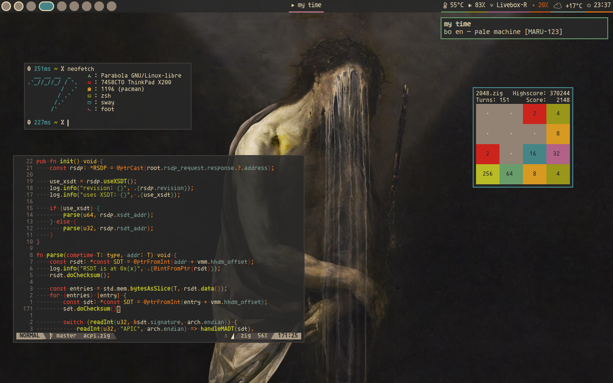
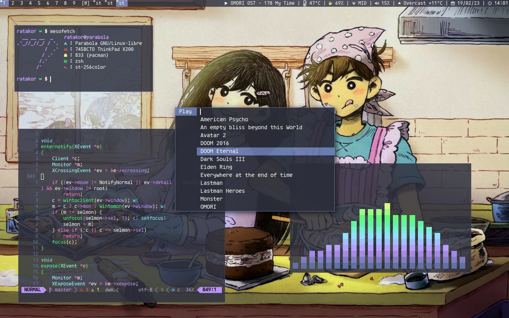

<h1 align="center">Ratakor's NixOS config</h1>


Outdated screenshot, although, it's fairly easy to reproduce on NixOS.\
My (deprecated) [parabola](https://github.com/ratakor/dotfiles/tree/parabola) config still look like that.


Outdated screenshot.\
My (deprecated) [artix](https://github.com/ratakor/dotfiles/tree/artix) config still look like that.

## Repo Structure

- [`flake`](flake): Individual parts of this flake.
  - [`apps`](flake/apps): Custom applications to be run with `nix run`.
  - [`lib`](flake/lib): Custom library of functions and utilities.
  - [`pkgs`](flake/pkgs): Custom packages and wrapped configurations.
  - [`templates`](flake/templates): Language specific templates for quickly initializing new projects.
  - [`fmt.nix`](flake/fmt.nix): Formatting configuration for `nix fmt` via [treefmt-nix](https://github.com/numtide/treefmt-nix).
  - [`keys.nix`](flake/keys.nix): My public SSH keys.
- [`hosts`](hosts): Per-host configurations.
- [`modules`](modules): Modularized configurations.
  - [`nixos`](modules/nixos): System & user configuration shared across all hosts.
  - [`options`](modules/options): Modules options for customizing each host nixos config. ([documentation](https://ratakor.github.io/dotfiles/options.html))
  - [`profiles`](modules/profiles): Shared configurations between similar machines.

<!--
## Commit Convention

```git-commit
<scope>: <message>
```

### Scopes:

- `{path}`: Modification to a specific file or directory. Extension can be omitted if it makes sense.
- `hosts[/{host}]`: Modification to `hosts`.
- `[nixos/]{scope}`: Modification to `modules/nixos`.
- `options[/{option-group}]`: Modification to `modules/options`.
- `profiles[/{profile}]`: Modification to `modules/profiles`.
- `lib`: Modification to `flake/lib`.
- `packages[/{package}]`: Modification to `flake/pkgs[/packages]`.
- `wrappers[/{wrapper}]`: Modification to `flake/pkgs/wrappers`.
- `templates[/{template}]`: Modification to `flake/templates`.
-->

## Credits

- [NotAShelf/nyx](https://github.com/NotAShelf/nyx/)
- [foo-dogsquared/nixos-config](https://github.com/foo-dogsquared/nixos-config/)
- [fazzi/nixohess](https://gitlab.com/fazzi/nixohess)
- [sotormd/nixos](https://github.com/sotormd/nixos)
- [viperML/dotfiles](https://github.com/viperML/dotfiles)
- [sioodmy/dotfiles](https://github.com/sioodmy/dotfiles)
- [ryan4yin/nixos-and-flakes](https://nixos-and-flakes.thiscute.world/)
